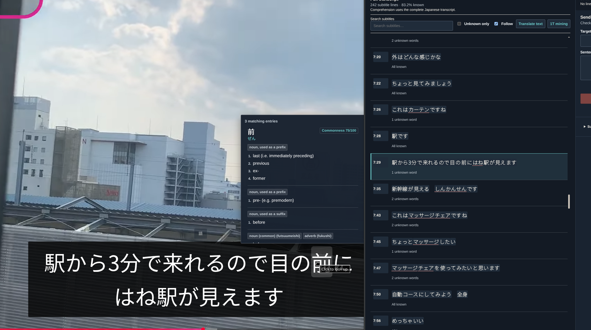

# Goi

I like WaniKani, I hate Anki and the existing easy mining products never felt like they are worth the money.
So now we have this - a simple, selfhosted, free helper app built around immersion into Japanese.

Goi uses WaniKani style lessons and reviews and comes
with a browser extension for mining the content you consume.

It's not exactly polished, but it does the job good enough for the price you're paying.

## What it does

This has all the features you'd want to enjoy japanese content and enough to learn the language.
It has a video player, it supports youtube transcripts, easy subtitle word definition look up or mining.



In short it:

- Teaches new vocabulary through lessons and a simple, predictable review schedule.
- Mines words with their sentence, source, and media from webpages, YouTube, and local videos.
- Shows you comprehension for a given video, webpage or a subtitle line.
- Tracks words learned elsewhere and allows you to export them. 
- Keeps everything on your machine and allows for simple backups.

The review system is intentionally fixed rather than FSRS-based. Predictable
reviews are easier to plan around, and the goal is to get back
to immersion rather than card solving. 

## Run it

The easiest way to run Goi is with Docker:

```sh
docker compose up -d --build
```

Then open [http://127.0.0.1:8080](http://127.0.0.1:8080). Application data and
local backups live in separate Docker volumes.

To run from source, install Go 1.26.6 and use:

```sh
APP_DATA_DIR="$PWD/data" APP_AUTH_MODE=false go run ./cmd/server
```

The first start creates the database and downloads the local dictionary.

Jiten Global and Novel frequency lists download in the background and are
checked weekly. Word badges show their original ranks as `G 039` and `N 036`;
lower ranks mean more frequent word forms. `—` means no rank is available.

Frequency data is adapted from [Jiten](https://jiten.moe/frequency-dictionaries)
under [CC BY-SA 4.0](https://creativecommons.org/licenses/by-sa/4.0/). The local
`jiten.sqlite` cache can be downloaded again and is excluded from study backups.

## Configuration

Goi runs without a login by default. For a typical Docker installation, create
a `.env` file next to `compose.yaml`:

```text
GOI_PORT=8080
APP_BASE_URL=http://localhost:8080
APP_TIME_ZONE=Europe/Vilnius
APP_AUTH_MODE=true
APP_AUTH_USERNAME=your-username
APP_AUTH_PASSWORD=use-a-long-unique-password
```

`APP_BASE_URL` must be the address you actually use to reach Goi, including
HTTPS when it sits behind a reverse proxy or tunnel.

Google Drive backups, translation, example generation, and the browser
extension are configured from **Settings** inside the app.

## Browser extension

Download the Chrome extension from **Settings → Browser extension**. It can
analyze ordinary webpages, capture selected text, work with YouTube captions,
and play local videos with SRT, WebVTT, ASS, or SSA subtitles.

See the [extension guide](browser-extension/README.md) for installation,
shortcuts, privacy, and current limitations.

## Translations

We provide multiple ways to do translations. Sadly Azure has the best free plan
so that's what is implemented for non AI translations. Half the time I can't even login
to Azure because it doesn't work, so sorry if you have to suffer to set it up.

There is also AI based translation though, so feel free to use that.

## Development

There is no frontend package install or extension build step. See
[CONTRIBUTING.md](CONTRIBUTING.md) to run the project and [TESTING.md](TESTING.md)
for the checks that matter before a release.

Goi uses the [Sustainable Use License](LICENSE). Third-party notices are listed
in [NOTICE](NOTICE).
